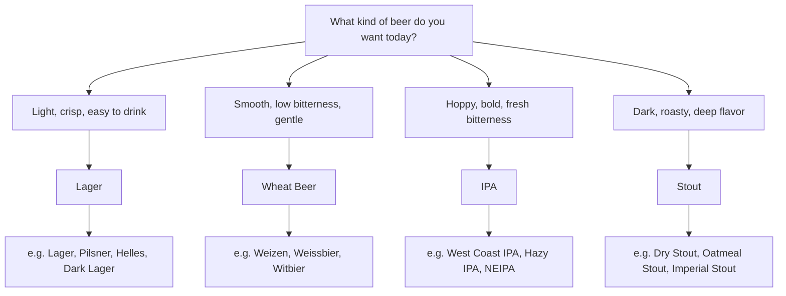

# 🍺 Meet the 4 Beer Families

If you're just getting into craft beer and you open a menu to find names like Lager, Pilsner, Wheat Beer, Weizen, Witbier, IPA, Hazy IPA, Stout, or Porter — and you feel like "there's too much, where do I start?" — don't worry, this is completely normal.

The world of beer has a lot of styles, but you don't need to memorize every name on day one. The easiest way to start is to think of beer in terms of **"flavor families"** first.

---

## 🗺️ The 4 Beer Families at a Glance

<h3>🌾 Lager</h3>

<strong>Light, crisp, clean, easy to drink</strong>

The most popular beer style in the world. Perfect for days when you want a cold, refreshing beer that's not too complicated.

<h3>🌾 Wheat Beer</h3>

<strong>Smooth, low bitterness, gentle</strong>

Made with wheat as the key ingredient, giving it a soft mouthfeel, great foam, and a friendly personality.

<h3>🍯 IPA</h3>

<strong>Hoppy, bold flavor, full of character</strong>

Hops are the star here — delivering fruity, citrusy, floral, or piney aromas depending on the variety.

<h3>☕ Stout</h3>

<strong>Dark, roasty, deep flavor</strong>

Dark beer from roasted malt, with notes of coffee, chocolate, and caramel. Perfect for sipping slowly.

&nbsp;

---

## 🧭 Pick by the Flavor You Want Today

Not sure where to start? Ask yourself what kind of flavor you're in the mood for:

| If you want this flavor | Start with |
|---|---|
| 🌿 Light, crisp, clean, easy | **Lager** |
| 🌾 Smooth, low bitterness, wheat or yeast notes | **Wheat Beer** |
| 🍯 Hoppy, fruity, fresh bitterness | **IPA** |
| ☕ Dark, roasty, coffee, chocolate | **Stout** |

---

<section class="beer-section">

## 🌿 1. Lager — The Clean, Crisp, Easy-Drinking Beer

Lager is the beer most people are familiar with — even if they don't always realize it, because the majority of mainstream beers worldwide belong to the Lager family.

The defining characteristics of Lager are **clean, crisp, easy to drink, and with a fairly sharp finish**. It doesn't lean heavily on yeast character, isn't as bitter as IPA, and isn't as dark and roasty as Stout.

### 👅 What does it taste like?

- Pale yellow to golden and clear
- Light malt aroma — bread, crackers, or grain
- Low to medium bitterness
- Refreshing carbonation with a clean, sharp finish

<h4>Lager</h4>

Light-colored, easy to drink, refreshing, and clean-tasting. A great starting point for those new to craft beer.

<h4>Pilsner</h4>

A Lager with more pronounced hop character, slightly more bitterness, and a crisper finish. Perfect for those who want the freshness of a Lager with more personality.

<h4>Helles</h4>

A German-style Lager that emphasizes malt sweetness over bitterness. Easy-drinking, round, and smooth.

<h4>Dark Lager</h4>

A darker Lager with roasted malt, caramel, or toasted bread notes — but still easier to drink than many dark beers like Stout.

### 🍽️ What food pairs well?

Lager pairs great with fried foods, grilled dishes, and bold flavors — the crispness and carbonation cut through the richness.

**At OpenCraft, try pairing with:** French fries, chicken karaage, crispy pork belly, grilled Angus skewers, spicy salads

</section>

---

<section class="beer-section">

## 🌾 2. Wheat Beer — The Smooth, Low-Bitterness, Friendly Beer

Wheat Beer uses wheat as a key ingredient, giving it a soft mouthfeel, great foam, and a drinkability that surprises many people.

If Lager is about cleanliness and crispness, **Wheat Beer is about smoothness, gentleness, and approachability**.

### 👅 What does it taste like?

- Soft body, easy to drink
- Low to medium bitterness
- Good foam, may have a natural haze
- Aromas of banana, clove, bread, wheat, citrus, or spices

<h4>Weizen / Weissbier</h4>

German-style wheat beer with prominent yeast-driven aromas like banana, clove, or soft bread notes.

<h4>Witbier</h4>

Belgian-style wheat beer with citrus and spice notes like orange peel and coriander. Bright and perfect for warm weather.

<h4>Dunkles Weissbier</h4>

A darker wheat beer with added malt, toasted bread, or caramel notes — but still retaining the soft character of Wheat Beer.

### 🍽️ What food pairs well?

Wheat Beer pairs well with fresh, tangy, spicy, or moderately rich foods — the smooth body helps balance bold flavors.

**At OpenCraft, try pairing with:** Vietnamese sausage salad, glass noodle salad, karaage with sriracha mayo, wasabi octopus, shrimp omelette rice

</section>

---

<section class="beer-section">

## 🍯 3. IPA — The Hoppy, Bold, Full-of-Character Beer

IPA, or India Pale Ale, is one of the styles that put modern craft beer on the map — it's a beer with unmistakable character.

The star of IPA is the **hop** — the ingredient that provides aroma, flavor, and bitterness. Different hop varieties deliver different aromas: some citrusy, some tropical, some piney, floral, herbal, or resinous.

### 👅 What does it taste like?

- Pronounced hop aroma — citrus, tropical fruit, pine, or floral
- Medium to high bitterness
- Some are clear and crisp / some are hazy, soft, and juicy

<h4>West Coast IPA</h4>

Clear, sharp, with assertive bitterness and citrus, pine, or resinous hop aromas. For those who love the bitterness and freshness of hops.

<h4>Hazy IPA / NEIPA</h4>

Hazy, soft, juicy, and bursting with fruit aroma. Often lower in bitterness than West Coast IPA — great for those who want to try IPA without the harsh bite.

<h4>Double IPA</h4>

An intensified IPA with higher alcohol, fuller body, and bigger hop character. For those who want a flavor-packed beer to sip slowly.

<h4>Session IPA</h4>

A lighter IPA that's easier to drink but still delivers hop aroma. Perfect for days when you want IPA flavor without the heaviness.

### 🍽️ What food pairs well?

IPA pairs well with bold, spicy, fried, and rich foods — the bitterness and hop aromas cut through the grease.

**At OpenCraft, try pairing with:** Chili salt crispy pork belly, chili salt chicken karaage, dried beef jerky, tuna salad, canned fish salad

</section>

---

<section class="beer-section">

## ☕ 4. Stout — Dark, Roasty, Deep — But Not as Intimidating as You Think

Many people see a black Stout and assume it must be very strong, very heavy, or hard to drink. But in reality, Stout comes in many forms, and it doesn't always mean high alcohol.

The defining feature of Stout is the flavor and aroma from **roasted malt** — coffee, chocolate, cocoa, caramel, burnt bread, or roasted nuts.

### 👅 What does it taste like?

- Very dark — from deep brown to black
- Coffee, chocolate, or roasted malt aromas
- Body ranges from medium to full
- Some finish dry, some are sweet and smooth

<h4>Dry Stout</h4>

A relatively dry Stout that's easier to drink than its dark color suggests. Features roasted coffee aroma and roasted malt bitterness without a sweet finish.

<h4>Oatmeal Stout</h4>

Brewed with oats for a smooth, silky, and round mouthfeel. Great for those who want a dark beer that isn't too dry.

<h4>Milk Stout / Sweet Stout</h4>

Sweeter and smoother than other Stouts — feels like coffee with milk or chocolate milk.

<h4>Imperial Stout</h4>

The big brother of the Stout family — intense, strong, full-bodied, and complex. Best sipped slowly.

### 🍽️ What food pairs well?

Stout pairs well with grilled food, heavy fried dishes, and desserts — the roasted flavors complement the charred, smoky notes in food.

**At OpenCraft, try pairing with:** Grilled Angus skewers, dried beef jerky, crispy pork belly

</section>

---

## ✨ Summary: Start with What You Want, Not Style Names

If you can't remember all the beer names yet, that's perfectly fine. Start with what you're craving in that glass.

- Want **light and crisp** → Go for **Lager** 🌿
- Want **smooth and mild** → Go for **Wheat Beer** 🌾
- Want **hoppy and bold** → Go for **IPA** 🍯
- Want **dark and roasty** → Go for **Stout** ☕

No style is better than another, and you don't need to like the same thing every time. The fun of craft beer is discovering what you enjoy.

> 💡 **Just tell the OpenCraft team:**
>
> "I want something light and crisp" → We'll suggest a Lager  
> "I want something smooth, not too bitter" → Try a Wheat Beer  
> "Give me a fruity IPA" → We'll recommend a Hazy IPA  
> "I want to try a dark beer that's not too heavy" → Dry Stout or Oatmeal Stout  
>
> **We'll help you find the perfect glass! 🍻**
