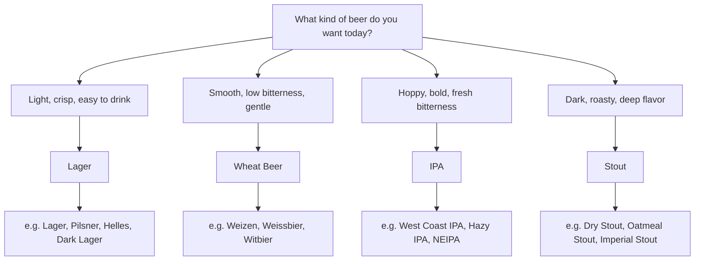

# 🍺 A Beginner's Guide to 4 Common Beer Style Groups

If you're just getting into craft beer and you open a menu to find names like Lager, Pilsner, Wheat Beer, Weizen, Witbier, IPA, Hazy IPA, Stout, or Porter — and you feel like "there's too much, where do I start?" — don't worry, this is completely normal.

The world of beer has a lot of styles, but you do not need to memorize every name on day one. A practical way to begin is to group beers by **broad flavor direction** first.

Strictly speaking, these are not the only real "families" in brewing taxonomy. They are a **beginner-friendly map** built around what drinkers usually notice in the glass: crispness, wheat character, hop expression, or roasted depth.

---

## 🗺️ 4 Useful Starting Groups at a Glance

<h3>🌾 Lager</h3>

<strong>Light, crisp, clean, easy to drink</strong>

The most common starting point for many drinkers: refreshing, straightforward, and often very clean in profile.

<h3>🌾 Wheat Beer</h3>

<strong>Smooth, low bitterness, gentle</strong>

Usually built partly with wheat, which often gives a softer body, dense foam, and a gentler overall impression.

<h3>🍯 IPA</h3>

<strong>Hoppy, bold flavor, full of character</strong>

Hop aroma is usually the main focus here, ranging from citrus and tropical fruit to pine, resin, flowers, or herbs.

<h3>☕ Stout</h3>

<strong>Dark, roasty, deep flavor</strong>

Dark beer shaped by roasted grain character, often showing coffee, cocoa, toast, or dark chocolate notes.

&nbsp;

---

## 🧭 Pick by the Flavor You Want Today

Not sure where to start? Ask yourself what kind of flavor you're in the mood for:

```mermaid
flowchart TD
    A["What kind of beer do you want today?"] --> B["Light, crisp, easy to drink"]
    A --> C["Smooth, low bitterness, gentle"]
    A --> D["Hoppy, bold, fresh bitterness"]
    A --> E["Dark, roasty, deep flavor"]

    B --> L["Lager"]
    C --> W["Wheat Beer"]
    D --> I["IPA"]
    E --> S["Stout"]

    L --> L1["e.g. Lager, Pilsner, Helles, Dark Lager"]
    W --> W1["e.g. Weizen, Weissbier, Witbier"]
    I --> I1["e.g. West Coast IPA, Hazy IPA, NEIPA"]
    S --> S1["e.g. Dry Stout, Oatmeal Stout, Imperial Stout"]
```

| If you want this flavor | Start with |
|---|---|
| 🌿 Light, crisp, clean, easy | **Lager** |
| 🌾 Smooth, low bitterness, wheat or yeast notes | **Wheat Beer** |
| 🍯 Hoppy, fruity, fresh bitterness | **IPA** |
| ☕ Dark, roasty, coffee, chocolate | **Stout** |

---

<section class="beer-section">

## 🌿 1. Lager — Clean, Crisp, and Usually Easy-Drinking

Lager is the beer many people know best, even if they do not always call it by name, because a large share of mainstream beer worldwide is lager.

As a broad group, lager often reads as **clean, crisp, and fermentation-neutral**. It usually shows less yeast-driven fruitiness than many ales, which allows malt, bitterness, and carbonation to come through more clearly.

### 👅 What does it taste like?

- Pale yellow to golden, often clear
- Light malt aroma — bread, crackers, or grain
- Low to medium bitterness
- Refreshing carbonation with a clean, sharp finish

<h4>Lager</h4>

Light-colored, refreshing, and clean-tasting. A common starting point for people new to beer styles.

<h4>Pilsner</h4>

A lager with more noticeable hop bitterness and a firmer finish than many standard pale lagers.

<h4>Helles</h4>

A German pale lager that leans more toward soft malt than sharp bitterness. Rounder and gentler than pilsner.

<h4>Dark Lager</h4>

A darker lager with bread crust, toast, caramel, or mild roast notes, but usually a cleaner fermentation profile than stout.

### 🍽️ What food pairs well?

Lager often pairs well with fried foods, grilled dishes, and salty or spicy flavors because carbonation and dryness help cut through richness.

**At OpenCraft, try pairing with:** French fries, chicken karaage, crispy pork belly, grilled Angus skewers, spicy salads

</section>

---

<section class="beer-section">

## 🌾 2. Wheat Beer — Soft, Rounded, and Often Low in Bitterness

Wheat Beer usually includes a significant proportion of wheat, which often contributes softer texture, persistent foam, and a hazy appearance.

If lager often feels crisp and sharp, **wheat beer more often feels soft, rounded, and expressive through yeast or grain character**.

### 👅 What does it taste like?

- Soft body, often easy to drink
- Low to medium bitterness
- Good foam, may have a natural haze
- Aromas of banana, clove, bread, wheat, citrus, or spices

<h4>Weizen / Weissbier</h4>

German wheat beer with yeast-driven aromas such as banana, clove, and soft bready notes.

<h4>Witbier</h4>

Belgian wheat beer with citrus and spice notes such as orange peel and coriander.

<h4>Dunkles Weissbier</h4>

A darker wheat beer with more malt depth, toast, and darker bread character, while still keeping the soft wheat profile.

### 🍽️ What food pairs well?

Wheat Beer often works well with bright, tangy, spicy, or moderately rich foods because its softer body can cushion sharper flavors.

**At OpenCraft, try pairing with:** Vietnamese sausage salad, glass noodle salad, karaage with sriracha mayo, wasabi octopus, shrimp omelette rice

</section>

---

<section class="beer-section">

## 🍯 3. IPA — Hop-Forward and Full of Aroma

IPA, or India Pale Ale, is one of the styles most associated with modern craft beer because hop aroma and bitterness are usually placed front and center.

The star of IPA is the **hop** — the ingredient that contributes aroma, flavor, and bitterness. Different hop varieties can suggest citrus, tropical fruit, pine, flowers, herbs, resin, or spice.

### 👅 What does it taste like?

- Pronounced hop aroma — citrus, tropical fruit, pine, or floral
- Medium to high bitterness
- Some are clear and firm; others are hazy, soft, and juicy

<h4>West Coast IPA</h4>

Clear, firm, and usually more bitter, with hop character that often leans citrusy, piney, or resinous.

<h4>Hazy IPA / NEIPA</h4>

Hazy, softer in texture, and strongly aromatic, often with tropical fruit notes and a gentler bitterness than West Coast IPA.

<h4>Double IPA</h4>

A stronger IPA with higher alcohol, fuller body, and more concentrated hop character.

<h4>Session IPA</h4>

A lighter IPA that keeps noticeable hop aroma while reducing alcohol and weight.

### 🍽️ What food pairs well?

IPA often pairs well with spicy, fried, fatty, or boldly seasoned food because bitterness and carbonation can cut through oil and richness.

**At OpenCraft, try pairing with:** Chili salt crispy pork belly, chili salt chicken karaage, dried beef jerky, tuna salad, canned fish salad

</section>

---

<section class="beer-section">

## ☕ 4. Stout — Dark, Roasty, and Wider-Ranging Than Many People Expect

Many people see a black stout and assume it must be very strong or heavy. In practice, stout covers a wide range, and dark colour does not automatically mean high alcohol or extreme body.

The defining feature of stout is roasted grain character — notes like coffee, cocoa, dark chocolate, toast, burnt bread crust, or roasted nuts.

### 👅 What does it taste like?

- Very dark — from deep brown to black
- Coffee, chocolate, or roasted malt aromas
- Body ranges from medium to full
- Some finish dry; others are sweeter and smoother

<h4>Dry Stout</h4>

A drier stout with roasted coffee-like aroma and bitterness, usually less sweet than fuller dessert-like examples.

<h4>Oatmeal Stout</h4>

Brewed with oats for a smoother, silkier texture and a rounder body.

<h4>Milk Stout / Sweet Stout</h4>

Sweeter and softer than many other stouts, sometimes suggesting milk coffee or chocolate milk.

<h4>Imperial Stout</h4>

A stronger, fuller-bodied stout with deeper roast, alcohol, and layering of flavor. Often better suited to slower drinking.

### 🍽️ What food pairs well?

Stout often pairs well with grilled food, richer fried dishes, and some desserts because roast notes can echo char, smoke, cocoa, or caramelized flavors.

**At OpenCraft, try pairing with:** Grilled Angus skewers, dried beef jerky, crispy pork belly

</section>

---

## ✨ Summary: Start with Flavor, Not Taxonomy

If you cannot remember every style name yet, that is completely fine. Start with the kind of flavor or texture you want in the glass.

- Want **light and crisp** → Go for **Lager** 🌿
- Want **smooth and mild** → Go for **Wheat Beer** 🌾
- Want **hoppy and bold** → Go for **IPA** 🍯
- Want **dark and roasty** → Go for **Stout** ☕

No group is "best." This is simply a practical way to narrow down what to try first.

> 💡 **Just tell the OpenCraft team:**
>
> "I want something light and crisp" → We'll suggest a Lager  
> "I want something smooth, not too bitter" → Try a Wheat Beer  
> "Give me a fruity IPA" → We'll recommend a Hazy IPA  
> "I want to try a dark beer that's not too heavy" → Dry Stout or Oatmeal Stout  
>
> **We'll help narrow it down for you. 🍻**
