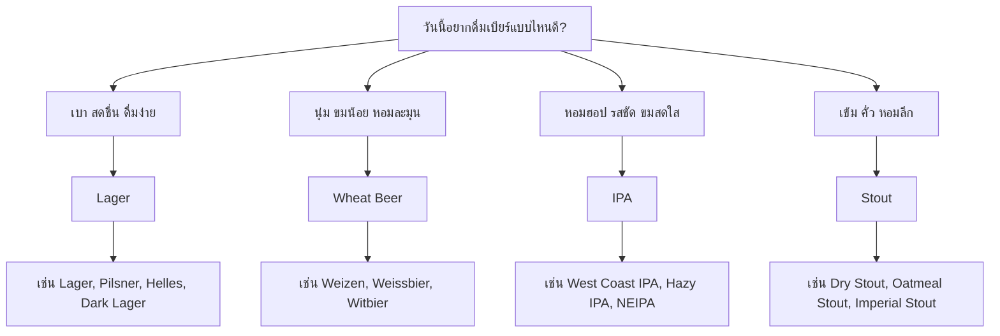

ถ้าเพิ่งเริ่มสนใจคราฟต์เบียร์ แล้วเปิดเมนูขึ้นมาเจอชื่ออย่าง Lager, Pilsner, Wheat Beer, Weizen, Witbier, IPA, Hazy IPA, Stout หรือ Porter แล้วรู้สึกว่า "เยอะไปหมด เริ่มจากตรงไหนดี?" — ไม่ต้องห่วง นี่คือเรื่องปกติ

โลกของเบียร์มีสไตล์เยอะจริง ๆ แต่เราไม่จำเป็นต้องจำทุกชื่อในวันแรก วิธีเริ่มที่ง่ายที่สุดคือมองเบียร์เป็น **"กลุ่มรสชาติ"** ก่อน

---

## 🗺️ ภาพรวม 4 บ้านใหญ่ของเบียร์

<h3>🌾 Lager</h3>

<strong>เบา สดชื่น สะอาด ดื่มง่าย</strong>

เบียร์ที่ได้รับความนิยมมากที่สุดในโลก เหมาะกับวันที่อยากได้เบียร์เย็น ๆ ดื่มสบาย ไม่ซับซ้อนเกินไป

<h3>🌾 Wheat Beer</h3>

<strong>นุ่ม ขมน้อย หอมละมุน</strong>

เบียร์ที่ใช้ข้าวสาลีเป็นวัตถุดิบหลัก ให้สัมผัสนุ่ม ฟองดี และเป็นมิตรกับทุกคน

<h3>🍯 IPA</h3>

<strong>หอมฮอป รสชัด มีคาแรกเตอร์</strong>

เบียร์ที่ฮอปเป็นพระเอก ให้กลิ่นผลไม้ ซิตรัส ดอกไม้ หรือสน แล้วแต่สายพันธุ์

<h3>☕ Stout</h3>

<strong>เข้ม คั่ว หอมลึก</strong>

เบียร์สีเข้มจากมอลต์คั่ว ให้กลิ่นกาแฟ ช็อกโกแลต คาราเมล เหมาะกับการจิบช้า ๆ

&nbsp;

---

## 🧭 เลือกจากรสที่อยากได้วันนี้

ไม่รู้จะเริ่มจากไหน? ลองถามตัวเองว่าวันนี้อยากได้รสแบบไหน:

| ถ้าอยากได้รสแบบนี้ | ลองเริ่มจาก |
|---|---|
| 🌿 เบา สดชื่น สะอาด ดื่มง่าย | **Lager** |
| 🌾 นุ่ม ขมน้อย หอมข้าวสาลีหรือยีสต์ | **Wheat Beer** |
| 🍯 หอมฮอป ผลไม้ชัด ขมสดใส | **IPA** |
| ☕ เข้ม คั่ว กาแฟ ช็อกโกแลต | **Stout** |

---

<section class="beer-section">

## 🌿 1. Lager — เบียร์สายสะอาด สดชื่น และดื่มง่าย

Lager เป็นเบียร์ที่หลายคนคุ้นเคยที่สุด แม้บางครั้งเราอาจไม่รู้ตัว เพราะเบียร์กระแสหลักจำนวนมากในโลกอยู่ในครอบครัว Lager

คาแรกเตอร์หลักของ Lager คือ **สะอาด สดชื่น ดื่มง่าย และจบรสค่อนข้างคม** รสชาติไม่ได้เน้นยีสต์จัด ไม่ได้ขมหนักแบบ IPA และไม่ได้คั่วเข้มแบบ Stout

### 👅 รสชาติประมาณไหน?

- สีเหลืองอ่อนถึงทองใส
- กลิ่นมอลต์เบา ๆ คล้ายขนมปัง แครกเกอร์ หรือธัญพืช
- ความขมต่ำถึงปานกลาง
- ความซ่าสดชื่น จบรสคม สะอาด

<h4>Lager</h4>

เบียร์สีอ่อน ดื่มง่าย สดชื่น และมีรสชาติสะอาด เป็นจุดเริ่มต้นที่ดีสำหรับคนที่ยังไม่คุ้นกับคราฟต์เบียร์

<h4>Pilsner</h4>

เป็น Lager ที่มักมีฮอปชัดขึ้น ขมขึ้นเล็กน้อย และจบรสคมกว่า เหมาะกับคนที่อยากได้ความสดชื่นแบบ Lager แต่มีคาแรกเตอร์มากขึ้น

<h4>Helles</h4>

Lager สไตล์เยอรมันที่เน้นความนุ่มของมอลต์มากกว่าความขม ดื่มง่าย กลม และละมุน

<h4>Dark Lager</h4>

Lager สีเข้มที่มีกลิ่นมอลต์คั่ว คาราเมล หรือขนมปังอบ แต่ยังดื่มง่ายกว่าเบียร์ดำอย่าง Stout หลายตัว

### 🍽️ จับคู่กับอาหารอะไรดี?

Lager เข้ากับของทอด ของย่าง และอาหารรสจัดได้ดี เพราะความสดชื่นและความซ่าช่วยตัดความมัน

**ที่ OpenCraft ลองจับคู่กับ:** เฟรนช์ฟรายส์, ไก่คาราเกะ, หมูสามชั้นทอดน้ำปลา, เนื้อแองกัสเสียบไม้, ยำรสจัด

</section>

---

<section class="beer-section">

## 🌾 2. Wheat Beer — เบียร์ข้าวสาลีที่นุ่ม ขมน้อย และเป็นมิตร

Wheat Beer คือเบียร์ที่ใช้ข้าวสาลีเป็นส่วนประกอบสำคัญ ทำให้สัมผัสโดยรวมมักนุ่ม ฟองดี และดื่มสบายกว่าที่หลายคนคิด

ถ้า Lager คือความสะอาดและสดชื่น **Wheat Beer คือความนุ่ม ละมุน และเป็นกันเอง**

### 👅 รสชาติประมาณไหน?

- บอดี้นุ่ม ดื่มสบาย
- ความขมต่ำถึงปานกลาง
- ฟองค่อนข้างดี อาจมีความขุ่นตามธรรมชาติ
- มีกลิ่นกล้วย กานพลู ขนมปัง ข้าวสาลี ซิตรัส หรือเครื่องเทศ

<h4>Weizen / Weissbier</h4>

เบียร์ข้าวสาลีสไตล์เยอรมัน มักมีกลิ่นเด่นจากยีสต์ เช่น กล้วย กานพลู หรือกลิ่นขนมปังนุ่ม ๆ

<h4>Witbier</h4>

เบียร์ข้าวสาลีสไตล์เบลเยียม มักมีกลิ่นซิตรัสและเครื่องเทศ เช่น ผิวส้มและลูกผักชี สดใสและเหมาะกับอากาศร้อน

<h4>Dunkles Weissbier</h4>

เบียร์ข้าวสาลีสีเข้มขึ้น มีกลิ่นมอลต์ ขนมปังอบ หรือคาราเมลเพิ่มเข้ามา แต่ยังมีความนุ่มแบบ Wheat Beer อยู่

### 🍽️ จับคู่กับอาหารอะไรดี?

Wheat Beer เข้ากับอาหารที่มีความสด เปรี้ยว เผ็ด หรือมันแบบพอดี เพราะความนุ่มของเบียร์ช่วยบาลานซ์รสจัด

**ที่ OpenCraft ลองจับคู่กับ:** ยำหมูยอ, ยำรวมมิตรเส้นแก้ว, ไก่คาราเกะศรีราชามาโย, ทาโกะวาซาบิ, ข้าวไข่ข้นกุ้ง

</section>

---

<section class="beer-section">

## 🍯 3. IPA — เบียร์สายฮอป หอมชัด และรสมีบุคลิก

IPA หรือ India Pale Ale เป็นหนึ่งในสไตล์ที่ทำให้คราฟต์เบียร์ยุคใหม่เป็นที่รู้จักกว้างขึ้น เพราะมันเป็นเบียร์ที่มีคาแรกเตอร์ชัดมาก

จุดเด่นของ IPA คือ **ฮอป** ซึ่งเป็นวัตถุดิบที่ให้กลิ่น รส และความขมในเบียร์ ฮอปแต่ละสายพันธุ์ให้กลิ่นต่างกัน บางตัวออกซิตรัส บางตัวออกผลไม้เมืองร้อน บางตัวออกสน ดอกไม้ สมุนไพร หรือยางไม้

### 👅 รสชาติประมาณไหน?

- กลิ่นฮอปชัด — โทนซิตรัส ผลไม้เมืองร้อน สน หรือดอกไม้
- ความขมปานกลางถึงสูง
- บางตัวใส คม ขมชัด / บางตัวขุ่น นุ่ม ฉ่ำผลไม้

<h4>West Coast IPA</h4>

ใส คม ขมชัด และมักมีกลิ่นฮอปโทนซิตรัส สน หรือยางไม้ เหมาะกับคนที่ชอบความขมและความสดของฮอป

<h4>Hazy IPA / NEIPA</h4>

IPA ที่ขุ่น นุ่ม ฉ่ำ และหอมผลไม้ชัด มักขมนุ่มกว่า West Coast IPA หลายตัว เหมาะกับคนที่อยากลอง IPA แบบไม่ขมกระแทกเกินไป

<h4>Double IPA</h4>

IPA ที่เพิ่มความเข้มขึ้น ทั้งแอลกอฮอล์ บอดี้ และคาแรกเตอร์ฮอป เหมาะกับคนที่อยากได้เบียร์รสแน่นและจิบช้าขึ้น

<h4>Session IPA</h4>

IPA ที่เบาลง ดื่มง่ายขึ้น แต่ยังคงกลิ่นฮอป เหมาะกับวันที่อยากได้ความหอมแบบ IPA โดยไม่อยากดื่มอะไรหนักเกินไป

### 🍽️ จับคู่กับอาหารอะไรดี?

IPA เข้ากับอาหารรสจัด ของทอด และอาหารมัน ๆ ได้ดี เพราะความขมและกลิ่นฮอปช่วยตัดเลี่ยน

**ที่ OpenCraft ลองจับคู่กับ:** หมูสามชั้นคั่วพริกเกลือ, ไก่คาราเกะคั่วพริกเกลือ, เนื้อแดดเดียวทอด, ยำปลาทูน่า, ยำปลากระป๋อง

</section>

---

<section class="beer-section">

## ☕ 4. Stout — เบียร์เข้ม คั่ว หอมลึก แต่ไม่ได้น่ากลัวอย่างที่คิด

หลายคนเห็น Stout สีดำแล้วคิดว่าต้องแรงมาก หนักมาก หรือดื่มยากมาก แต่ความจริง Stout มีหลายแบบ และไม่ได้แปลว่าแอลกอฮอล์สูงเสมอไป

จุดเด่นของ Stout คือกลิ่นและรสจากมอลต์คั่ว เช่น กาแฟ ช็อกโกแลต โกโก้ คาราเมล ขนมปังไหม้ หรือถั่วคั่ว

### 👅 รสชาติประมาณไหน?

- สีเข้มมาก ตั้งแต่น้ำตาลเข้มถึงดำ
- กลิ่นกาแฟ ช็อกโกแลต หรือมอลต์คั่ว
- บอดี้ตั้งแต่กลางไปจนถึงหนัก
- บางตัวจบแห้ง บางตัวหวานนุ่ม

<h4>Dry Stout</h4>

Stout ที่ค่อนข้างแห้ง ดื่มง่ายกว่าสีของมัน มีกลิ่นกาแฟคั่วและความขมจากมอลต์คั่ว จบรสไม่หวานมาก

<h4>Oatmeal Stout</h4>

มีการใช้โอ๊ต ทำให้สัมผัสนุ่ม ลื่น และกลมขึ้น เหมาะกับคนที่อยากได้เบียร์ดำที่ไม่แห้งเกินไป

<h4>Milk Stout / Sweet Stout</h4>

มีความหวานและความนุ่มมากกว่า ให้ความรู้สึกคล้ายกาแฟใส่นมหรือช็อกโกแลตนม

<h4>Imperial Stout</h4>

รุ่นใหญ่ของบ้าน Stout มักเข้ม แรง บอดี้แน่น และรสซับซ้อน เหมาะกับการจิบช้า ๆ

### 🍽️ จับคู่กับอาหารอะไรดี?

Stout เข้ากับอาหารย่าง อาหารทอดเข้ม ๆ และของหวานได้ดี เพราะกลิ่นคั่วของเบียร์ช่วยเสริมกลิ่นไหม้หอมของอาหาร

**ที่ OpenCraft ลองจับคู่กับ:** เนื้อแองกัสเสียบไม้, เนื้อแดดเดียวทอด, หมูสามชั้นทอดน้ำปลา

</section>

---

## ✨ สรุป: เริ่มจากรสที่อยากได้ ไม่ต้องเริ่มจากชื่อสไตล์

ถ้ายังจำชื่อเบียร์ไม่ได้ทั้งหมด ไม่เป็นไรเลย ให้เริ่มจากความรู้สึกที่อยากได้ในแก้วนั้นก่อน

- อยากได้ **เบา สดชื่น** → เลือก **Lager** 🌿
- อยากได้ **นุ่ม ขมน้อย** → เลือก **Wheat Beer** 🌾
- อยากได้ **หอมฮอป รสชัด** → เลือก **IPA** 🍯
- อยากได้ **เข้ม คั่ว หอมลึก** → เลือก **Stout** ☕

ไม่มีสไตล์ไหนดีที่สุดสำหรับทุกคน และไม่จำเป็นต้องชอบเหมือนกันทุกแก้ว ความสนุกของคราฟต์เบียร์คือการค่อย ๆ สำรวจว่าเราชอบอะไร

> 💡 **บอกทีมงาน OpenCraft ง่าย ๆ:**
>
> "อยากได้เบา ๆ สดชื่น" → เราจะแนะนำ Lager  
> "อยากได้เบียร์นุ่ม ๆ ไม่ขมมาก" → ลอง Wheat Beer  
> "ขอ IPA ที่หอมผลไม้" → เดี๋ยวแนะนำ Hazy IPA  
> "อยากลองเบียร์ดำที่ไม่หนักเกินไป" → Dry Stout หรือ Oatmeal Stout  
>
> **เดี๋ยวเราช่วยเลือกแก้วที่เหมาะกับคุณให้เอง! 🍻**