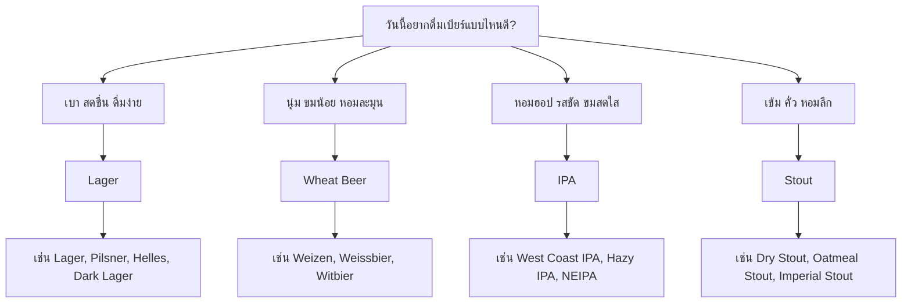

# 🍺 คู่มือเริ่มต้นกับ 4 กลุ่มสไตล์เบียร์ที่เจอบ่อย

ถ้าเพิ่งเริ่มสนใจคราฟต์เบียร์ แล้วเปิดเมนูขึ้นมาเจอชื่ออย่าง Lager, Pilsner, Wheat Beer, Weizen, Witbier, IPA, Hazy IPA, Stout หรือ Porter แล้วรู้สึกว่า "เยอะไปหมด เริ่มจากตรงไหนดี?" — ไม่ต้องห่วง นี่คือเรื่องปกติ

โลกของเบียร์มีสไตล์เยอะจริง ๆ แต่เราไม่จำเป็นต้องจำทุกชื่อในวันแรก วิธีเริ่มที่ใช้งานได้ง่ายคือมองเบียร์เป็น **"กลุ่มรสชาติ"** ก่อน

พูดให้ตรงคือ 4 กลุ่มนี้ไม่ใช่การจัดหมวดทางวิชาการแบบตายตัว แต่เป็น **แผนที่สำหรับคนเริ่มต้น** ที่ช่วยให้เลือกเบียร์จากสิ่งที่เรามักรับรู้ได้ก่อนในแก้ว เช่น ความสดชื่น คาแรกเตอร์ข้าวสาลี ความเด่นของฮอป หรือความคั่วลึก

---

## 🗺️ ภาพรวม 4 กลุ่มเริ่มต้นที่ใช้งานได้ดี

<h3>🌾 Lager</h3>

<strong>เบา สดชื่น สะอาด ดื่มง่าย</strong>

กลุ่มที่หลายคนเริ่มต้นได้ง่าย เพราะมักสดชื่น ตรงไปตรงมา และสะอาดในคาแรกเตอร์

<h3>🌾 Wheat Beer</h3>

<strong>นุ่ม ขมน้อย หอมละมุน</strong>

มักมีข้าวสาลีเป็นส่วนประกอบสำคัญ จึงให้สัมผัสนุ่ม ฟองแน่น และอารมณ์โดยรวมที่ละมุนกว่า

<h3>🍯 IPA</h3>

<strong>หอมฮอป รสชัด มีคาแรกเตอร์</strong>

กลุ่มที่ให้ฮอปเป็นตัวนำ อาจออกผลไม้ ซิตรัส ดอกไม้ สน ยางไม้ หรือสมุนไพรตามสายพันธุ์ที่ใช้

<h3>☕ Stout</h3>

<strong>เข้ม คั่ว หอมลึก</strong>

เบียร์สีเข้มที่มีคาแรกเตอร์จากมอลต์คั่วหรือธัญพืชคั่ว เช่น กาแฟ โกโก้ ดาร์กช็อกโกแลต หรือขนมปังไหม้

&nbsp;

---

## 🧭 เลือกจากรสที่อยากได้วันนี้

ไม่รู้จะเริ่มจากไหน? ลองถามตัวเองว่าวันนี้อยากได้รสแบบไหน:

```mermaid
flowchart TD
    A["วันนี้อยากดื่มเบียร์แบบไหนดี?"] --> B["เบา สดชื่น ดื่มง่าย"]
    A --> C["นุ่ม ขมน้อย หอมละมุน"]
    A --> D["หอมฮอป รสชัด ขมสดใส"]
    A --> E["เข้ม คั่ว หอมลึก"]

    B --> L["Lager"]
    C --> W["Wheat Beer"]
    D --> I["IPA"]
    E --> S["Stout"]

    L --> L1["เช่น Lager, Pilsner, Helles, Dark Lager"]
    W --> W1["เช่น Weizen, Weissbier, Witbier"]
    I --> I1["เช่น West Coast IPA, Hazy IPA, NEIPA"]
    S --> S1["เช่น Dry Stout, Oatmeal Stout, Imperial Stout"]
```

| ถ้าอยากได้รสแบบนี้ | ลองเริ่มจาก |
|---|---|
| 🌿 เบา สดชื่น สะอาด ดื่มง่าย | **Lager** |
| 🌾 นุ่ม ขมน้อย หอมข้าวสาลีหรือยีสต์ | **Wheat Beer** |
| 🍯 หอมฮอป ผลไม้ชัด ขมสดใส | **IPA** |
| ☕ เข้ม คั่ว กาแฟ ช็อกโกแลต | **Stout** |

---

<section class="beer-section">

## 🌿 1. Lager — สะอาด สดชื่น และมักดื่มง่าย

Lager เป็นเบียร์ที่หลายคนคุ้นเคยที่สุด แม้บางครั้งเราอาจไม่ได้เรียกชื่อมันตรง ๆ เพราะเบียร์กระแสหลักจำนวนมากในโลกเป็น lager

โดยรวมแล้ว lager มักให้ความรู้สึก **สะอาด สดชื่น และคาแรกเตอร์จากการหมักไม่เด่นมาก** จึงปล่อยให้มอลต์ ความขม และความซ่าแสดงตัวได้ชัด

### 👅 รสชาติประมาณไหน?

- สีเหลืองอ่อนถึงทอง และมักใส
- กลิ่นมอลต์เบา ๆ คล้ายขนมปัง แครกเกอร์ หรือธัญพืช
- ความขมต่ำถึงปานกลาง
- ความซ่าสดชื่น จบรสคม สะอาด

<h4>Lager</h4>

เบียร์สีอ่อน สดชื่น และคาแรกเตอร์สะอาด เป็นจุดเริ่มต้นที่เข้าถึงง่ายสำหรับคนที่เพิ่งเริ่มรู้จักสไตล์เบียร์

<h4>Pilsner</h4>

เป็น lager ที่มักมีความขมและคาแรกเตอร์ฮอปชัดกว่าพาเลลาเกอร์ทั่วไป พร้อมจบท้ายที่คมกว่า

<h4>Helles</h4>

lager เยอรมันสีอ่อนที่เน้นความนุ่มของมอลต์มากกว่าความขม จึงให้ความรู้สึกกลมและละมุนกว่า pilsner

<h4>Dark Lager</h4>

lager สีเข้มที่ให้โทนขนมปังอบ toast คาราเมล หรือคั่วอ่อน ๆ แต่ยังมักสะอาดกว่าสาย stout

### 🍽️ จับคู่กับอาหารอะไรดี?

lager มักเข้ากับของทอด ของย่าง และอาหารเค็มหรือรสจัด เพราะความซ่าและความแห้งช่วยตัดความมันได้ดี

**ที่ OpenCraft ลองจับคู่กับ:** เฟรนช์ฟรายส์, ไก่คาราเกะ, หมูสามชั้นทอดน้ำปลา, เนื้อแองกัสเสียบไม้, ยำรสจัด

</section>

---

<section class="beer-section">

## 🌾 2. Wheat Beer — นุ่ม กลม และมักขมน้อย

Wheat Beer คือเบียร์ที่มีข้าวสาลีเป็นส่วนประกอบสำคัญ ซึ่งมักทำให้สัมผัสโดยรวมออกมานุ่ม ฟองดี และบางครั้งมีความขุ่นตามธรรมชาติ

ถ้า lager มักให้ความรู้สึกคมและสด Wheat Beer ก็มักให้ความรู้สึก **นุ่ม กลม และมีคาแรกเตอร์จากยีสต์หรือเนื้อธัญพืชชัดกว่า**

### 👅 รสชาติประมาณไหน?

- บอดี้นุ่ม และมักดื่มสบาย
- ความขมต่ำถึงปานกลาง
- ฟองค่อนข้างดี อาจมีความขุ่นตามธรรมชาติ
- มีกลิ่นกล้วย กานพลู ขนมปัง ข้าวสาลี ซิตรัส หรือเครื่องเทศ

<h4>Weizen / Weissbier</h4>

เบียร์ข้าวสาลีเยอรมันที่มักมีกลิ่นจากยีสต์ เช่น กล้วย กานพลู และโทนขนมปังนุ่ม ๆ

<h4>Witbier</h4>

เบียร์ข้าวสาลีเบลเยียมที่มักมีโทนซิตรัสและเครื่องเทศ เช่น ผิวส้มและลูกผักชี

<h4>Dunkles Weissbier</h4>

เบียร์ข้าวสาลีที่สีเข้มขึ้นและมีมิติมอลต์มากขึ้น เช่น ขนมปังอบ toast หรือคาราเมลอ่อน ๆ แต่ยังคงความนุ่มแบบ Wheat Beer

### 🍽️ จับคู่กับอาหารอะไรดี?

Wheat Beer มักเข้ากับอาหารที่สด เปรี้ยว เผ็ด หรือมันแบบพอดี เพราะความนุ่มของเบียร์ช่วยผ่อนแรงของรสจัดได้ดี

**ที่ OpenCraft ลองจับคู่กับ:** ยำหมูยอ, ยำรวมมิตรเส้นแก้ว, ไก่คาราเกะศรีราชามาโย, ทาโกะวาซาบิ, ข้าวไข่ข้นกุ้ง

</section>

---

<section class="beer-section">

## 🍯 3. IPA — เบียร์สายฮอปที่กลิ่นนำชัด

IPA หรือ India Pale Ale เป็นหนึ่งในสไตล์ที่คนมักนึกถึงเมื่อพูดถึงคราฟต์เบียร์ยุคใหม่ เพราะมันให้กลิ่นและรสของฮอปอย่างชัดเจน

จุดเด่นของ IPA คือ **ฮอป** ซึ่งเป็นวัตถุดิบที่ให้กลิ่น รส และความขม ฮอปแต่ละสายพันธุ์อาจให้ภาพจำต่างกัน เช่น ซิตรัส ผลไม้เมืองร้อน สน ดอกไม้ สมุนไพร หรือยางไม้

### 👅 รสชาติประมาณไหน?

- กลิ่นฮอปชัด — โทนซิตรัส ผลไม้เมืองร้อน สน หรือดอกไม้
- ความขมปานกลางถึงสูง
- บางตัวใสและคม บางตัวขุ่น นุ่ม และฉ่ำผลไม้

<h4>West Coast IPA</h4>

ใส คม และมักขมชัดกว่า พร้อมกลิ่นฮอปที่ไปทางซิตรัส สน หรือยางไม้

<h4>Hazy IPA / NEIPA</h4>

IPA ที่ขุ่นและนุ่มกว่า มักให้กลิ่นผลไม้ชัดและมีความขมที่อ่อนโยนกว่า West Coast IPA หลายตัว

<h4>Double IPA</h4>

IPA ที่เข้มขึ้นทั้งแอลกอฮอล์ บอดี้ และคาแรกเตอร์ฮอป

<h4>Session IPA</h4>

IPA ที่แอลกอฮอล์เบาลง แต่ยังเก็บกลิ่นฮอปไว้ได้ชัดพอสมควร

### 🍽️ จับคู่กับอาหารอะไรดี?

IPA มักเข้ากับอาหารรสจัด ของทอด และอาหารมัน เพราะความขมและความซ่าช่วยตัดเลี่ยนได้ดี

**ที่ OpenCraft ลองจับคู่กับ:** หมูสามชั้นคั่วพริกเกลือ, ไก่คาราเกะคั่วพริกเกลือ, เนื้อแดดเดียวทอด, ยำปลาทูน่า, ยำปลากระป๋อง

</section>

---

<section class="beer-section">

## ☕ 4. Stout — เบียร์เข้มคั่วที่มีหลายบุคลิกกว่าที่คิด

หลายคนเห็น stout สีดำแล้วคิดว่าต้องแรงมากหรือหนักมากเสมอ แต่จริง ๆ แล้ว stout มีหลายแบบ และสีเข้มไม่ได้แปลว่าแอลกอฮอล์สูงเสมอไป

จุดเด่นของ stout คือคาแรกเตอร์จากมอลต์หรือธัญพืชคั่ว เช่น กาแฟ โกโก้ ดาร์กช็อกโกแลต ขนมปังไหม้ หรือถั่วคั่ว

### 👅 รสชาติประมาณไหน?

- สีเข้มมาก ตั้งแต่น้ำตาลเข้มถึงดำ
- กลิ่นกาแฟ ช็อกโกแลต หรือมอลต์คั่ว
- บอดี้ตั้งแต่กลางไปจนถึงหนัก
- บางตัวจบแห้ง บางตัวหวานและนุ่มกว่า

<h4>Dry Stout</h4>

stout ที่ค่อนข้างแห้ง มีกลิ่นกาแฟคั่วและความขมจากมอลต์คั่ว โดยไม่เน้นความหวานปลายลิ้น

<h4>Oatmeal Stout</h4>

ใช้โอ๊ตเพื่อเพิ่มสัมผัสนุ่ม ลื่น และกลมขึ้น

<h4>Milk Stout / Sweet Stout</h4>

หวานและนุ่มกว่าสายอื่น บางครั้งให้อารมณ์คล้ายกาแฟใส่นมหรือช็อกโกแลตนม

<h4>Imperial Stout</h4>

stout ที่แอลกอฮอล์สูงและบอดี้แน่นกว่า พร้อมคาแรกเตอร์คั่วและความซับซ้อนที่มากขึ้น

### 🍽️ จับคู่กับอาหารอะไรดี?

Stout มักเข้ากับอาหารย่าง อาหารทอดรสเข้ม และของหวานบางชนิด เพราะกลิ่นคั่วของเบียร์ไปด้วยกันได้ดีกับโทนไหม้ รมควัน หรือโกโก้

**ที่ OpenCraft ลองจับคู่กับ:** เนื้อแองกัสเสียบไม้, เนื้อแดดเดียวทอด, หมูสามชั้นทอดน้ำปลา

</section>

---

## ✨ สรุป: เริ่มจากรสที่อยากได้ ไม่ต้องเริ่มจากการจำหมวด

ถ้ายังจำชื่อสไตล์ทั้งหมดไม่ได้ ไม่เป็นไรเลย ให้เริ่มจากรสและสัมผัสที่อยากได้ในแก้วก่อน

- อยากได้ **เบา สดชื่น** → เลือก **Lager** 🌿
- อยากได้ **นุ่ม ขมน้อย** → เลือก **Wheat Beer** 🌾
- อยากได้ **หอมฮอป รสชัด** → เลือก **IPA** 🍯
- อยากได้ **เข้ม คั่ว หอมลึก** → เลือก **Stout** ☕

ไม่มีสไตล์ไหนดีที่สุดสำหรับทุกคน 4 กลุ่มนี้เป็นเพียงวิธีช่วยย่นทางเลือกให้แคบลงตอนเริ่มต้นเท่านั้น

> 💡 **บอกทีมงาน OpenCraft ง่าย ๆ:**
>
> "อยากได้เบา ๆ สดชื่น" → เราจะแนะนำ Lager  
> "อยากได้เบียร์นุ่ม ๆ ไม่ขมมาก" → ลอง Wheat Beer  
> "ขอ IPA ที่หอมผลไม้" → เดี๋ยวแนะนำ Hazy IPA  
> "อยากลองเบียร์ดำที่ไม่หนักเกินไป" → Dry Stout หรือ Oatmeal Stout  
>
> **เดี๋ยวเราช่วยไล่ตัวเลือกให้แคบลงเอง 🍻**